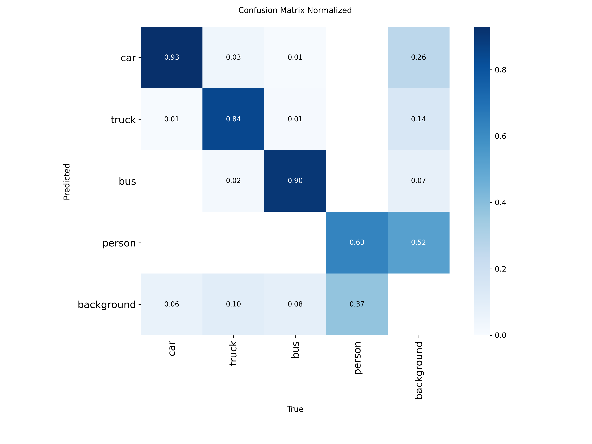
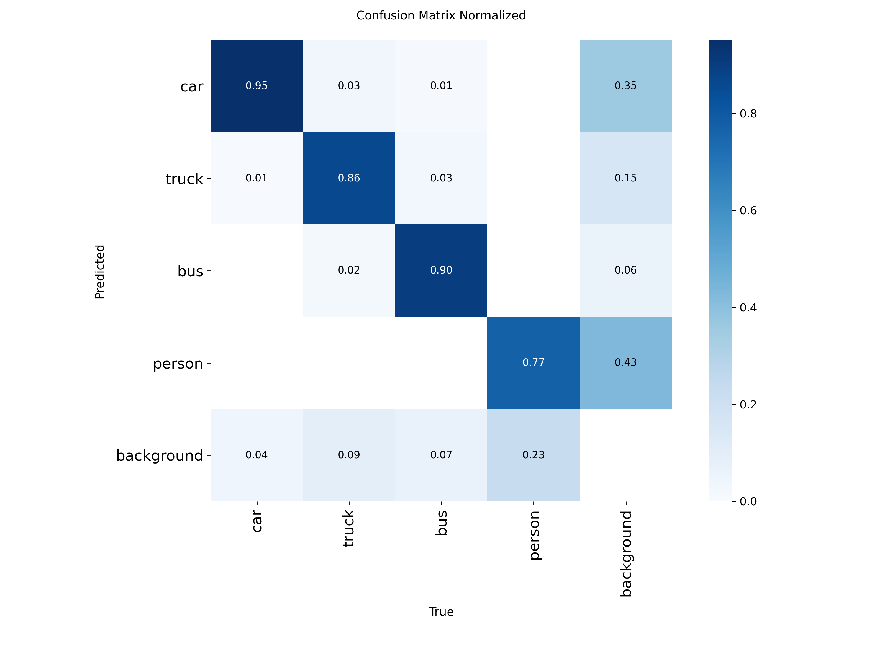
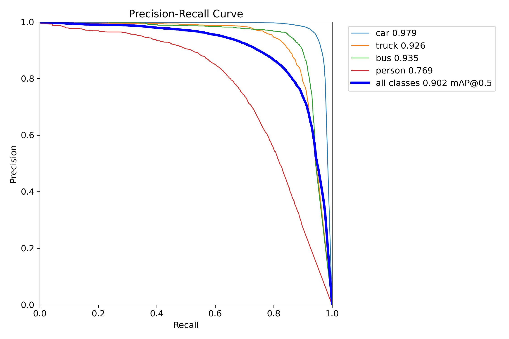
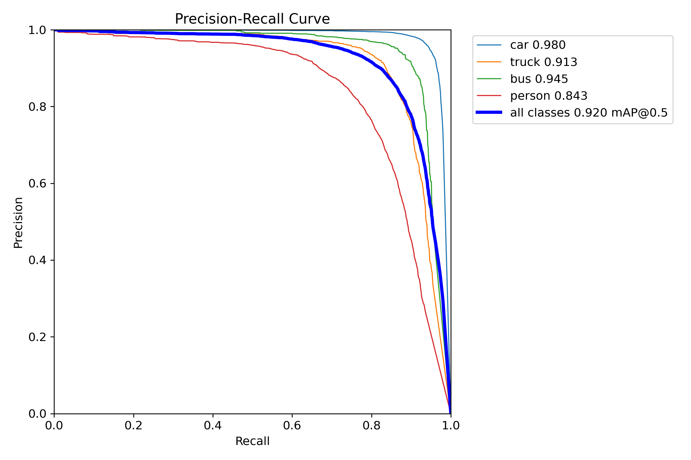

# Utilizing CFPT neck for YOLO11

This project modifies the **[Ultralytics YOLOv11](https://github.com/ultralytics/ultralytics)** architecture by replacing its default neck (PAFPN) with the **[Cross-layer Feature Pyramid Transformer (CFPT)](https://github.com/duzw9311/CFPT)** to improve small object detection in sparse LiDAR BEV images.


## Howto(Colab recommended)
```python
# 1. Install ultralytics. Only works with version 8.3.253 
!pip install -U ultralytics==8.3.253
```

```python
# 2. Clone Repository
!git clone https://github.com/Yongha026/YOLO11-CFPT.git
```

```python
# 3. Replace library
import shutil

shutil.rmtree("/usr/local/lib/python3.12/dist-packages/ultralytics/nn/")
shutil.copytree("/content/YOLO11-CFPT/ultralytics/ultralytics/nn/","/usr/local/lib/python3.12/dist-packages/ultralytics/nn")
```

```python
# 4. Train model
from ultralytics import YOLO

model = YOLO("/content/YOLO11-CFPT/ultralytics/ultralytics/cfg/models/11/yolo11n-CFPT-obb.yaml", task='obb')

model.train(
  data="dota8.yaml",
  amp=False,epochs=10,
  imgsz=640,
)
```

## Experiment

**Raw Lidar Dataset used** : **[고정밀데이터 수집차량 주간 도심도로 데이터](https://aihub.or.kr/aihubdata/data/view.do?currMenu=115&topMenu=100&dataSetSn=71577)** from **[AI hub](https://aihub.or.kr/)**

**Method** : Bird's Eye View(BEV) projection from **[Complex-YOLO](https://arxiv.org/abs/1803.06199)**

### Examples of processed image:
|  |  |  | 
| :---: | :---: | :---: |

### Problem : 'Person' Class being too small
|  | |
| :---: | :---: |

### Training Hyperparameters
<details>
<summary><b>Click to expand Training Hyperparameters</b></summary>
  
```python
  train_results_1 = model.train(
      # resume=True,
    data="/content/drive/MyDrive/ex06_lidar_yolo_dataset/obb10k_dataset.yaml",
    epochs=300,
    # warmup_epochs=1.0,
    imgsz=1440,
    project= "/content/drive/MyDrive/Ex06_Runs_lidar_front",
    name='YOLO-CFPT-P2-lr3',
    optimizer="AdamW",
    weight_decay=0.005,
    lr0=1e-3,
    lrf=0.1,
    amp=False,
    cos_lr=True,
    batch=8,
    workers=8,
    nbs =64,
    degrees=180.0,
    flipud=0.5,
    fliplr=0.5,
    hsv_h=0.0,
    hsv_s=0.0,    # h,s => Intensity & Height should not change
    hsv_v=0.1,
    # mosaic=0.0,
    mixup=0.4,
    copy_paste=0.4,
    perspective=0.0,
    shear=0.0,
    # close_mosaic=40,
    # box=7.0,
    cls=1.5,
    dfl=2.5
  )
```
</details>
  
## Results

|  |  |
| :---: | :---: |
|  |  |
| **Baseline YOLOv11** | **YOLOv11-CFPT** |

